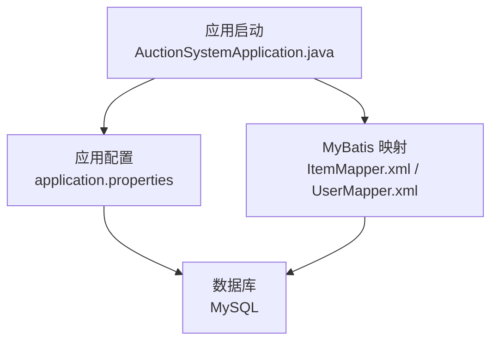
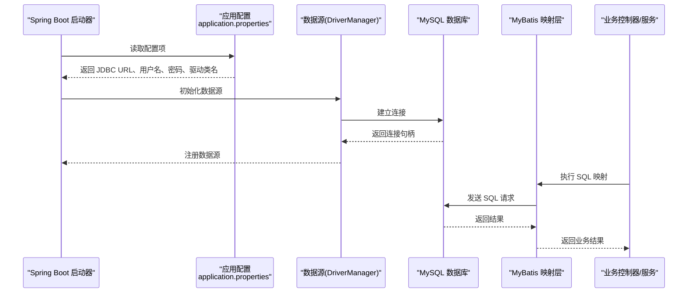
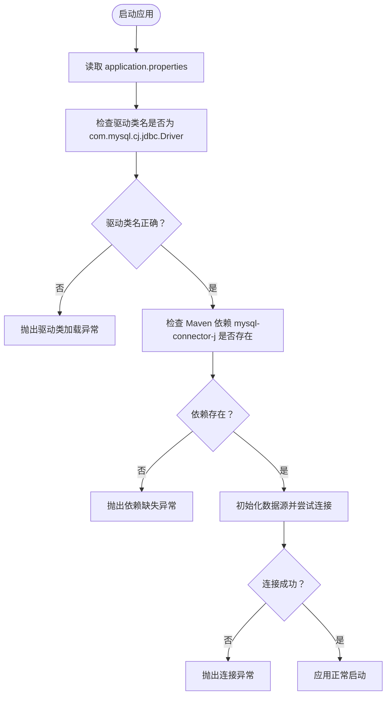
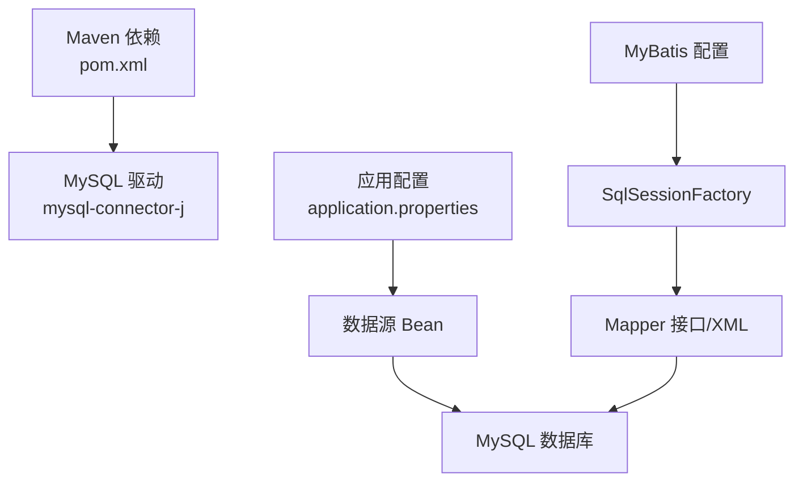

# 数据库连接配置

<cite>
**本文引用的文件**
- [application.properties](file://src/main/resources/application.properties)
- [pom.xml](file://pom.xml)
- [auction_database.sql](file://auction_database.sql)
- [AuctionSystemApplication.java](file://src/main/java/com/qkl/auctionsystem/AuctionSystemApplication.java)
- [ItemMapper.xml](file://src/main/resources/mapper/ItemMapper.xml)
- [UserMapper.xml](file://src/main/resources/mapper/UserMapper.xml)
</cite>

## 目录
1. [简介](#简介)
2. [项目结构](#项目结构)
3. [核心组件](#核心组件)
4. [架构总览](#架构总览)
5. [详细组件分析](#详细组件分析)
6. [依赖关系分析](#依赖关系分析)
7. [性能考虑](#性能考虑)
8. [故障排查指南](#故障排查指南)
9. [结论](#结论)
10. [附录](#附录)

## 简介
本文件聚焦于项目中的数据库连接配置，围绕 application.properties 中的 MySQL 相关配置项进行系统化解读，包括：
- JDBC 连接字符串的结构与参数含义（主机、端口、数据库名、字符集、SSL、时区）
- 账号与密码的安全管理建议（环境变量、配置中心）
- 驱动类名 com.mysql.cj.jdbc.Driver 的必要性与来源
- 结合项目实际配置值，提供常见连接失败问题的排查思路与生产最佳实践

## 项目结构
与数据库连接直接相关的关键文件与位置如下：
- 应用配置：src/main/resources/application.properties
- 依赖声明：pom.xml（包含 MySQL Connector/J 依赖）
- 数据库初始化脚本：auction_database.sql（定义数据库字符集与表结构）
- MyBatis 映射文件：src/main/resources/mapper/*.xml（用于验证数据库可用性与数据访问）
- 启动入口：src/main/java/com/qkl/auctionsystem/AuctionSystemApplication.java（Spring Boot 启动）

图表来源
- [AuctionSystemApplication.java](file://src/main/java/com/qkl/auctionsystem/AuctionSystemApplication.java#L1-L18)
- [application.properties](file://src/main/resources/application.properties#L1-L20)
- [ItemMapper.xml](file://src/main/resources/mapper/ItemMapper.xml#L1-L87)
- [UserMapper.xml](file://src/main/resources/mapper/UserMapper.xml#L1-L11)

章节来源
- [application.properties](file://src/main/resources/application.properties#L1-L20)
- [pom.xml](file://pom.xml#L43-L47)
- [auction_database.sql](file://auction_database.sql#L1-L78)
- [AuctionSystemApplication.java](file://src/main/java/com/qkl/auctionsystem/AuctionSystemApplication.java#L1-L18)

## 核心组件
本节从配置文件出发，逐项解析与 MySQL 相关的核心配置项及其作用。

- spring.datasource.url
  - 作用：定义 JDBC 连接字符串，用于建立到 MySQL 的连接。
  - 结构要点：
    - 协议与主机：jdbc:mysql://localhost
    - 端口：8864
    - 数据库名：auction
    - 参数：
      - useUnicode=true：启用 Unicode 支持
      - characterEncoding=utf8：字符编码（注意：项目中使用了 utf8mb4 字符集，详见数据库脚本）
      - useSSL=false：禁用 SSL
      - serverTimezone=GMT%2B8：服务器时区设置为 GMT+8
  - 实际意义：
    - 确保客户端与服务端字符集一致，避免乱码
    - 明确时区，避免时间字段在读写过程中出现偏差
    - 关闭 SSL 可简化开发环境配置，但生产环境建议开启

- spring.datasource.username
  - 作用：数据库连接用户名
  - 安全建议：不建议在配置文件中明文存储，推荐通过环境变量或配置中心注入

- spring.datasource.password
  - 作用：数据库连接密码
  - 安全建议：同上，优先使用外部安全机制管理

- spring.datasource.driver-class-name
  - 作用：指定 JDBC 驱动类名
  - 必须为 com.mysql.cj.jdbc.Driver 的原因：
    - Spring Boot 在 2.x 及以上版本默认使用 MySQL Connector/J 9.x（artifactId 为 mysql-connector-j）
    - 该驱动的主包名为 com.mysql.cj，因此类名固定为 com.mysql.cj.jdbc.Driver
    - 若使用旧版驱动（com.mysql.jdbc.Driver），将导致无法加载驱动类，引发连接异常

- MyBatis 相关配置（与连接间接相关）
  - mybatis.mapper-locations：映射文件路径
  - mybatis.type-aliases-package：实体类型别名包
  - mybatis.configuration.mapUnderscoreToCamelCase：字段命名策略
  - 作用：确保 MyBatis 能正确加载映射并执行 SQL，从而验证数据库连通性

章节来源
- [application.properties](file://src/main/resources/application.properties#L1-L20)
- [pom.xml](file://pom.xml#L43-L47)
- [auction_database.sql](file://auction_database.sql#L1-L78)

## 架构总览
下图展示了应用启动后，配置如何影响数据库连接与数据访问的整体流程。

图表来源
- [application.properties](file://src/main/resources/application.properties#L1-L20)
- [AuctionSystemApplication.java](file://src/main/java/com/qkl/auctionsystem/AuctionSystemApplication.java#L1-L18)
- [ItemMapper.xml](file://src/main/resources/mapper/ItemMapper.xml#L1-L87)
- [UserMapper.xml](file://src/main/resources/mapper/UserMapper.xml#L1-L11)

## 详细组件分析

### JDBC 连接字符串结构解析
- 主机与端口
  - 主机：localhost
  - 端口：8864
  - 说明：开发环境通常本地运行 MySQL，端口需与数据库实例一致
- 数据库名
  - 名称：auction
  - 说明：与数据库初始化脚本一致，确保应用连接到正确的数据库
- 字符集与编码
  - application.properties 中使用 characterEncoding=utf8
  - 数据库脚本中使用 DEFAULT CHARACTER SET utf8mb4
  - 建议：为避免潜在字符集不一致问题，可在 URL 中统一使用 utf8mb4 或在数据库侧保持一致
- SSL 设置
  - useSSL=false：关闭 SSL
  - 生产建议：开启 SSL 并配置证书校验，提升传输安全性
- 时区设置
  - serverTimezone=GMT%2B8：确保 Java 与数据库的时间处理一致
  - 注意：GMT%2B8 需要 URL 编码，否则可能被解析为 GMT+8 导致参数解析异常

章节来源
- [application.properties](file://src/main/resources/application.properties#L1-L20)
- [auction_database.sql](file://auction_database.sql#L1-L78)

### 驱动类名与依赖关系
- 驱动类名
  - 必须为 com.mysql.cj.jdbc.Driver
  - 原因：Spring Boot 默认使用 mysql-connector-j（artifactId），其主包名为 com.mysql.cj
- Maven 依赖
  - pom.xml 中声明了 mysql-connector-j 依赖，确保运行时可加载驱动
- 失败场景
  - 未引入 mysql-connector-j：启动时报找不到驱动类
  - 驱动类名错误：启动时报驱动类加载失败

图表来源
- [application.properties](file://src/main/resources/application.properties#L1-L20)
- [pom.xml](file://pom.xml#L43-L47)

章节来源
- [application.properties](file://src/main/resources/application.properties#L1-L20)
- [pom.xml](file://pom.xml#L43-L47)

### 账号与密码的安全管理
- 现状：application.properties 中明文存储用户名与密码
- 建议方案：
  - 环境变量注入：通过操作系统环境变量或容器编排工具注入
  - 配置中心：使用 Spring Cloud Config、Nacos、Consul 等集中式配置中心
  - 加密存储：对敏感信息进行加密，应用启动时解密
- 影响范围：上述任一方式均可替换 application.properties 中的明文配置，不影响其他配置项

章节来源
- [application.properties](file://src/main/resources/application.properties#L1-L20)

### MyBatis 与数据库连通性验证
- MyBatis 配置
  - mapper-locations 与 type-aliases-package：确保映射文件与实体类能被正确加载
  - mapUnderscoreToCamelCase：字段命名策略，便于对象映射
- 验证方法
  - 启动应用后，若能成功加载映射文件并执行 SQL，则表明数据库连接正常
  - 可通过访问相关接口触发 MyBatis 执行 SQL，观察日志输出

章节来源
- [application.properties](file://src/main/resources/application.properties#L10-L14)
- [ItemMapper.xml](file://src/main/resources/mapper/ItemMapper.xml#L1-L87)
- [UserMapper.xml](file://src/main/resources/mapper/UserMapper.xml#L1-L11)

## 依赖关系分析
- Spring Boot 自动装配
  - 通过 application.properties 中的数据源配置，自动装配数据源 Bean
- MyBatis 自动装配
  - 通过 mybatis-* starter 与配置，自动装配 SqlSessionFactory 与 Mapper 接口
- MySQL 驱动依赖
  - pom.xml 中声明 mysql-connector-j，确保运行时可用

图表来源
- [pom.xml](file://pom.xml#L43-L47)
- [application.properties](file://src/main/resources/application.properties#L1-L20)
- [ItemMapper.xml](file://src/main/resources/mapper/ItemMapper.xml#L1-L87)
- [UserMapper.xml](file://src/main/resources/mapper/UserMapper.xml#L1-L11)

章节来源
- [pom.xml](file://pom.xml#L43-L47)
- [application.properties](file://src/main/resources/application.properties#L1-L20)

## 性能考虑
- 连接池配置
  - 项目未显式配置连接池参数，Spring Boot 默认使用 HikariCP
  - 建议在生产环境根据 QPS、并发度调优连接池大小与超时参数
- 字符集一致性
  - URL 与数据库脚本字符集保持一致，避免额外转换开销与潜在乱码
- SSL 开启
  - 生产环境建议开启 SSL，并合理配置证书与握手参数，平衡安全与性能

## 故障排查指南
- 驱动缺失
  - 现象：启动时报找不到驱动类
  - 排查：确认 pom.xml 中已引入 mysql-connector-j
  - 处理：添加依赖并重新构建
  - 参考
    - [pom.xml](file://pom.xml#L43-L47)

- 驱动类名错误
  - 现象：启动时报驱动类加载失败
  - 排查：确认 driver-class-name 为 com.mysql.cj.jdbc.Driver
  - 处理：修正为正确的驱动类名
  - 参考
    - [application.properties](file://src/main/resources/application.properties#L1-L20)

- 网络不通
  - 现象：连接超时或拒绝
  - 排查：确认 MySQL 服务正在运行、端口 8864 可访问、防火墙放行
  - 处理：修复网络策略或数据库服务状态
  - 参考
    - [application.properties](file://src/main/resources/application.properties#L1-L20)

- 权限不足
  - 现象：认证失败或无权限访问数据库
  - 排查：确认用户名与密码正确，数据库用户具备相应权限
  - 处理：授予所需权限或修改用户凭据
  - 参考
    - [application.properties](file://src/main/resources/application.properties#L1-L20)

- 字符集不一致
  - 现象：中文乱码或特殊字符异常
  - 排查：确认 URL 字符集与数据库字符集一致
  - 处理：统一使用 utf8mb4 或调整数据库字符集
  - 参考
    - [application.properties](file://src/main/resources/application.properties#L1-L20)
    - [auction_database.sql](file://auction_database.sql#L1-L78)

- 时区偏差
  - 现象：时间字段显示与预期不符
  - 排查：确认 serverTimezone=GMT%2B8 已正确设置且 URL 编码无误
  - 处理：修正时区参数
  - 参考
    - [application.properties](file://src/main/resources/application.properties#L1-L20)

- SSL 配置
  - 现象：生产环境连接报 SSL 相关错误
  - 排查：确认已开启 SSL 并正确配置证书
  - 处理：按生产环境要求配置 SSL
  - 参考
    - [application.properties](file://src/main/resources/application.properties#L1-L20)

## 结论
- application.properties 中的 MySQL 配置项清晰地定义了连接目标、字符集、时区与驱动类名
- 驱动类名 com.mysql.cj.jdbc.Driver 是 Spring Boot 默认驱动的固定值，必须与 pom.xml 中的依赖匹配
- 生产环境应优先采用环境变量或配置中心管理敏感信息，开启 SSL 并统一字符集与时区设置
- 通过 MyBatis 映射文件可快速验证数据库连通性，便于定位连接问题

## 附录
- 数据库初始化脚本要点
  - 数据库字符集：utf8mb4
  - 表结构：用户、拍品、竞拍记录、订单
  - 初始数据：管理员与普通用户示例
- 参考文件
  - [auction_database.sql](file://auction_database.sql#L1-L78)