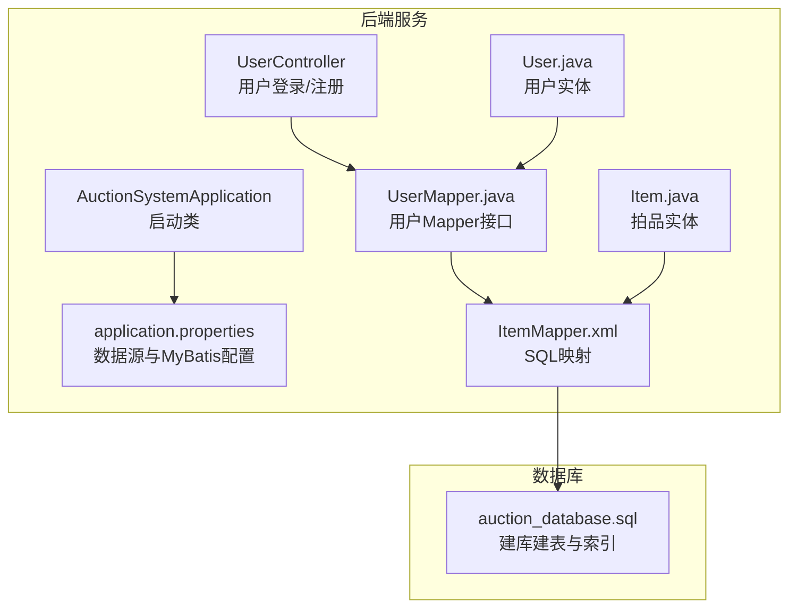
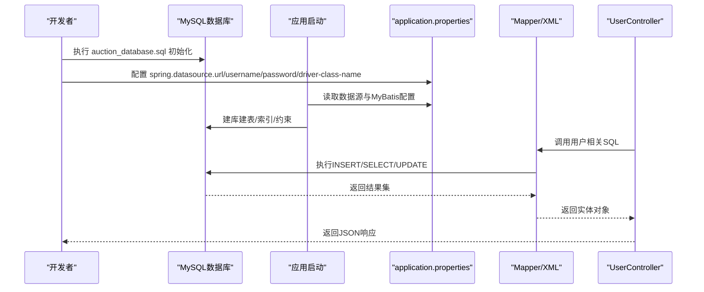
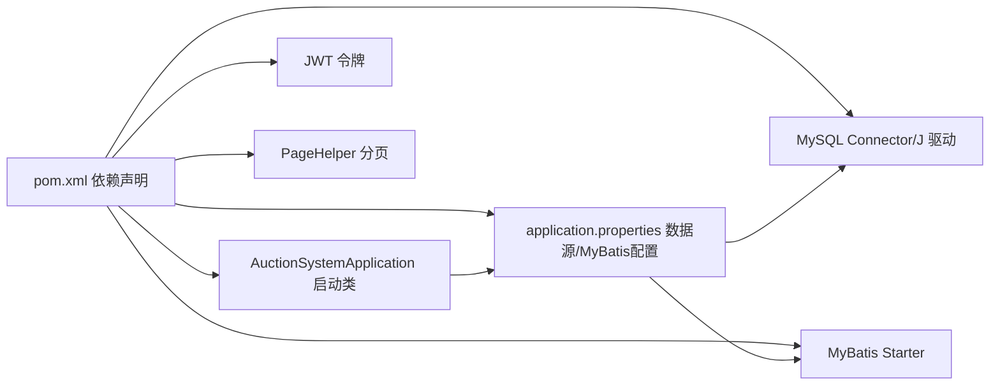
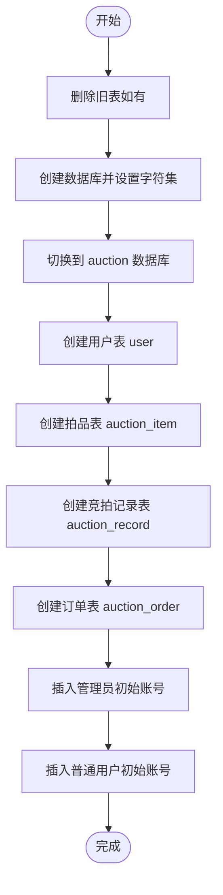

# 数据库配置

<cite>
**本文引用的文件**
- [application.properties](file://src/main/resources/application.properties)
- [auction_database.sql](file://auction_database.sql)
- [说明.md](file://说明.md)
- [pom.xml](file://pom.xml)
- [AuctionSystemApplication.java](file://src/main/java/com/qkl/auctionsystem/AuctionSystemApplication.java)
- [User.java](file://src/main/java/com/qkl/auctionsystem/pojo/entity/User.java)
- [Item.java](file://src/main/java/com/qkl/auctionsystem/pojo/entity/Item.java)
- [UserController.java](file://src/main/java/com/qkl/auctionsystem/controller/UserController.java)
- [UserMapper.java](file://src/main/java/com/qkl/auctionsystem/mapper/UserMapper.java)
- [ItemMapper.xml](file://src/main/java/com/qkl/auctionsystem/mapper/ItemMapper.xml)
</cite>

## 目录
1. [简介](#简介)
2. [项目结构](#项目结构)
3. [核心组件](#核心组件)
4. [架构总览](#架构总览)
5. [详细组件分析](#详细组件分析)
6. [依赖关系分析](#依赖关系分析)
7. [性能考虑](#性能考虑)
8. [故障排查指南](#故障排查指南)
9. [结论](#结论)
10. [附录](#附录)

## 简介
本文件面向开发者，提供完整的数据库配置与初始化指南，涵盖：
- Spring Boot 中 spring.datasource.* 配置项的含义与安全建议（推荐使用环境变量）
- 如何执行 auction_database.sql 完成数据库、表结构与约束初始化
- 数据库权限分配、字符集（utf8mb4）、时区（GMT+8）最佳实践
- 初始化管理员与普通用户的测试账号信息

## 项目结构
该拍卖系统基于 Spring Boot + MyBatis 构建，数据库配置集中在 application.properties 中，数据库初始化脚本为 auction_database.sql。核心实体类与映射文件位于 src/main/java 下，便于理解数据模型与字段映射。



图表来源
- [AuctionSystemApplication.java](file://src/main/java/com/qkl/auctionsystem/AuctionSystemApplication.java#L1-L18)
- [application.properties](file://src/main/resources/application.properties#L1-L20)
- [ItemMapper.xml](file://src/main/java/com/qkl/auctionsystem/mapper/ItemMapper.xml#L1-L29)
- [User.java](file://src/main/java/com/qkl/auctionsystem/pojo/entity/User.java#L1-L26)
- [Item.java](file://src/main/java/com/qkl/auctionsystem/pojo/entity/Item.java#L1-L34)
- [UserController.java](file://src/main/java/com/qkl/auctionsystem/controller/UserController.java#L1-L49)
- [UserMapper.java](file://src/main/java/com/qkl/auctionsystem/mapper/UserMapper.java#L1-L13)
- [auction_database.sql](file://auction_database.sql#L1-L78)

章节来源
- [application.properties](file://src/main/resources/application.properties#L1-L20)
- [auction_database.sql](file://auction_database.sql#L1-L78)
- [说明.md](file://说明.md#L1-L112)

## 核心组件
- 数据源配置：在 application.properties 中定义了 JDBC URL、用户名、密码与驱动类名
- MyBatis 配置：映射文件位置、类型别名包、下划线转驼峰
- 实体类与映射：User、Item 实体与对应的 Mapper XML 映射，体现字段命名与数据库列的对应关系
- 启动类：启用调度与 Servlet 组件扫描，作为应用入口

章节来源
- [application.properties](file://src/main/resources/application.properties#L1-L20)
- [pom.xml](file://pom.xml#L1-L129)
- [User.java](file://src/main/java/com/qkl/auctionsystem/pojo/entity/User.java#L1-L26)
- [Item.java](file://src/main/java/com/qkl/auctionsystem/pojo/entity/Item.java#L1-L34)
- [AuctionSystemApplication.java](file://src/main/java/com/qkl/auctionsystem/AuctionSystemApplication.java#L1-L18)

## 架构总览
系统通过 Spring Boot 自动装配数据源与 MyBatis，控制器调用服务层，服务层通过 Mapper 接口访问数据库。数据库初始化由 auction_database.sql 负责。



图表来源
- [application.properties](file://src/main/resources/application.properties#L1-L20)
- [auction_database.sql](file://auction_database.sql#L1-L78)
- [UserController.java](file://src/main/java/com/qkl/auctionsystem/controller/UserController.java#L1-L49)
- [UserMapper.java](file://src/main/java/com/qkl/auctionsystem/mapper/UserMapper.java#L1-L13)
- [ItemMapper.xml](file://src/main/java/com/qkl/auctionsystem/mapper/ItemMapper.xml#L1-L29)

## 详细组件分析

### 数据库配置项详解与安全建议
- spring.datasource.url
  - 作用：指定 JDBC 连接字符串，包含主机、端口、数据库名以及连接参数
  - 关键参数说明：
    - useUnicode=true：启用 Unicode 支持
    - characterEncoding=utf8：字符编码（建议使用 utf8mb4）
    - useSSL=false：禁用 SSL（开发环境常见，生产建议按需开启）
    - serverTimezone=GMT%2B8：时区设置为 GMT+8
  - 安全建议：
    - 不要在代码仓库中硬编码敏感信息，推荐使用环境变量注入
    - 在 CI/CD 中通过密钥管理服务或环境变量传入
- spring.datasource.username
  - 作用：数据库连接用户名
  - 安全建议：使用最小权限账户，避免使用 root 或高权限账户
- spring.datasource.password
  - 作用：数据库连接密码
  - 安全建议：使用强密码，定期轮换；在容器化部署中通过密文注入
- spring.datasource.driver-class-name
  - 作用：指定 JDBC 驱动类名（MySQL Connector/J）

最佳实践清单
- 字符集：统一使用 utf8mb4，以支持完整 UTF-8（包含 emoji）
- 时区：统一设置为 GMT+8，避免跨时区导致的时间偏差
- 连接池：可在 application.properties 中增加连接池参数（如 hikari 配置项），提升并发性能
- 加密传输：生产环境建议开启 SSL 并配置证书校验

章节来源
- [application.properties](file://src/main/resources/application.properties#L1-L20)
- [说明.md](file://说明.md#L1-L112)

### 数据库初始化脚本执行步骤
- 创建数据库与字符集
  - 使用 utf8mb4 与 utf8mb4_unicode_ci 排序规则
- 切换到 auction 数据库
- 删除旧表（若存在）：auction_order、auction_record、auction_item、user
- 依次创建以下表：
  - user：用户表，包含 id、username、password、role、时间戳字段
  - auction_item：拍品表，包含标题、图片、起拍价、时间范围、状态、上架状态等
  - auction_record：竞拍记录表，记录每次出价的金额与时间
  - auction_order：订单表，关联拍品与买家，记录成交价格与订单状态
- 插入初始数据：
  - 管理员账号：用户名 admin，角色 0
  - 普通用户账号：用户名 user，角色 1
  - 注意：脚本中的密码字段为占位符，实际应用中应使用加密后的密码

执行顺序与注意事项
- 先执行建库与建表，再插入初始用户
- 若数据库已有同名表，脚本会先 DROP 再 CREATE，注意备份
- 确保数据库版本与字符集设置一致，避免排序规则不匹配

章节来源
- [auction_database.sql](file://auction_database.sql#L1-L78)
- [说明.md](file://说明.md#L1-L112)

### 表结构与约束概览
- user
  - 主键：id
  - 唯一键：username
  - 字段：username、password、role、时间戳
- auction_item
  - 主键：id
  - 索引：status、listing_status、start_time、end_time
  - 字段：title、image、initial_price、description、start_time、end_time、current_max_price、current_max_user_id、status、listing_status、时间戳
- auction_record
  - 主键：id
  - 索引：item_id、user_id、bid_time
  - 字段：item_id、user_id、bid_price、bid_time
- auction_order
  - 主键：id
  - 唯一键：item_id
  - 索引：user_id、status
  - 字段：item_id、user_id、deal_price、status、update_time

章节来源
- [auction_database.sql](file://auction_database.sql#L1-L78)
- [说明.md](file://说明.md#L1-L112)

### 测试账号信息
- 管理员账号
  - 用户名：admin
  - 角色：0（管理员）
- 普通用户账号
  - 用户名：user
  - 角色：1（普通用户）
- 登录流程
  - 用户通过 UserController 的登录接口提交用户名与密码
  - 服务层验证后生成 JWT 令牌，返回用户 ID、角色与令牌

章节来源
- [auction_database.sql](file://auction_database.sql#L74-L78)
- [UserController.java](file://src/main/java/com/qkl/auctionsystem/controller/UserController.java#L1-L49)

### 数据模型与映射关系
- 实体类与数据库字段映射
  - User.java：id、username、password、role、createTime、updateTime
  - Item.java：id、title、image、initialPrice、description、startTime、endTime、currentMaxPrice、currentMaxUserId、status、listingStatus、createTime、updateTime
- Mapper XML 映射
  - ItemMapper.xml：将实体属性映射到数据库列名（如 initial_price、start_time 等），并处理空值与条件插入

```mermaid
erDiagram
USER {
bigint id PK
varchar username UK
varchar password
tinyint role
datetime create_time
datetime update_time
}
AUCTION_ITEM {
bigint id PK
varchar title
varchar image
decimal initial_price
varchar description
datetime start_time
datetime end_time
decimal current_max_price
bigint current_max_user_id
tinyint status
tinyint listing_status
datetime create_time
datetime update_time
}
AUCTION_RECORD {
bigint id PK
bigint item_id FK
bigint user_id FK
decimal bid_price
datetime bid_time
}
AUCTION_ORDER {
bigint id PK
bigint item_id UK FK
bigint user_id FK
decimal deal_price
tinyint status
datetime update_time
}
USER ||--o{ AUCTION_RECORD : "出价"
USER ||--o{ AUCTION_ORDER : "买家"
AUCTION_ITEM ||--o{ AUCTION_RECORD : "拍品"
AUCTION_ITEM ||--|| AUCTION_ORDER : "成交"
```

图表来源
- [auction_database.sql](file://auction_database.sql#L1-L78)
- [User.java](file://src/main/java/com/qkl/auctionsystem/pojo/entity/User.java#L1-L26)
- [Item.java](file://src/main/java/com/qkl/auctionsystem/pojo/entity/Item.java#L1-L34)
- [ItemMapper.xml](file://src/main/java/com/qkl/auctionsystem/mapper/ItemMapper.xml#L1-L29)

## 依赖关系分析
- 应用启动类启用调度与 Servlet 组件扫描，作为 Spring Boot 应用入口
- pom.xml 引入 Spring Boot Web、MyBatis Starter、MySQL Connector/J、JWT、PageHelper 等依赖
- application.properties 提供数据源与 MyBatis 配置



图表来源
- [pom.xml](file://pom.xml#L1-L129)
- [AuctionSystemApplication.java](file://src/main/java/com/qkl/auctionsystem/AuctionSystemApplication.java#L1-L18)
- [application.properties](file://src/main/resources/application.properties#L1-L20)

章节来源
- [pom.xml](file://pom.xml#L1-L129)
- [AuctionSystemApplication.java](file://src/main/java/com/qkl/auctionsystem/AuctionSystemApplication.java#L1-L18)
- [application.properties](file://src/main/resources/application.properties#L1-L20)

## 性能考虑
- 字符集与排序规则
  - 建议统一使用 utf8mb4 与 utf8mb4_unicode_ci，减少字符集转换开销
- 索引优化
  - 拍品表对 status、listing_status、start_time、end_time 建立索引，有利于筛选与排序
  - 记录表对 item_id、user_id、bid_time 建立索引，提升查询效率
  - 订单表对 user_id、status 建立索引，便于用户订单查询
- 连接池与超时
  - 可在 application.properties 中配置连接池参数（如最大连接数、空闲超时、连接超时等），以提升并发能力
- 事务与锁
  - 对高并发场景下的出价与订单生成，建议使用合适的事务隔离级别与锁策略，避免脏读与幻读

[本节为通用性能建议，不直接分析具体文件]

## 故障排查指南
- 连接失败
  - 检查 spring.datasource.url 是否正确指向数据库主机与端口
  - 确认用户名与密码是否正确，数据库是否存在
  - 若使用 SSL，确认证书配置与 serverTimezone 设置
- 字符乱码
  - 确认数据库字符集为 utf8mb4，排序规则为 utf8mb4_unicode_ci
  - 确认 JDBC URL 中 characterEncoding 与 useUnicode 参数生效
- 时间显示异常
  - 确认 serverTimezone=GMT%2B8 已正确设置
- 表结构不一致
  - 重新执行 auction_database.sql，确保建库建表顺序与索引约束一致
- 登录失败
  - 确认初始化用户是否存在，密码是否加密（脚本中为占位符，实际应用中应加密）

章节来源
- [application.properties](file://src/main/resources/application.properties#L1-L20)
- [auction_database.sql](file://auction_database.sql#L1-L78)

## 结论
通过规范的数据源配置、严格的字符集与时区设置、完善的表结构与索引设计，以及合理的安全与性能优化策略，可以为拍卖系统提供稳定可靠的数据库支撑。建议在开发与生产环境中均采用环境变量注入敏感信息，并持续监控与优化数据库性能。

[本节为总结性内容，不直接分析具体文件]

## 附录

### 数据库初始化流程图


图表来源
- [auction_database.sql](file://auction_database.sql#L1-L78)

### 数据源配置项对照表
- spring.datasource.url：JDBC 连接字符串，包含主机、端口、数据库名与连接参数
- spring.datasource.username：数据库连接用户名
- spring.datasource.password：数据库连接密码
- spring.datasource.driver-class-name：JDBC 驱动类名

章节来源
- [application.properties](file://src/main/resources/application.properties#L1-L20)