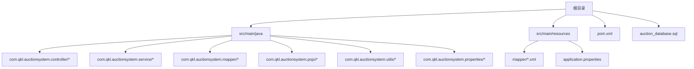
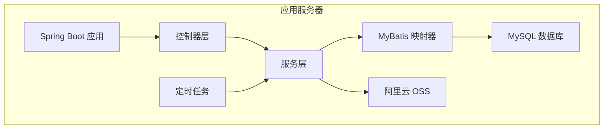
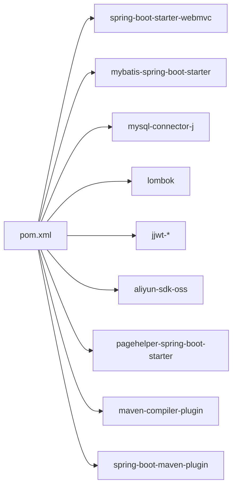

# 环境配置

<cite>
**本文引用的文件**
- [pom.xml](file://pom.xml)
- [application.properties](file://src/main/resources/application.properties)
- [AuctionSystemApplication.java](file://src/main/java/com/qkl/auctionsystem/AuctionSystemApplication.java)
- [AliyunOSSProperties.java](file://src/main/java/com/qkl/auctionsystem/properties/AliyunOSSProperties.java)
- [auction_database.sql](file://auction_database.sql)
- [说明.md](file://说明.md)
</cite>

## 目录
1. [简介](#简介)
2. [项目结构](#项目结构)
3. [核心组件](#核心组件)
4. [架构总览](#架构总览)
5. [详细组件分析](#详细组件分析)
6. [依赖分析](#依赖分析)
7. [性能考虑](#性能考虑)
8. [故障排查指南](#故障排查指南)
9. [结论](#结论)
10. [附录](#附录)

## 简介
本指南面向AuctionSystem项目的环境配置与部署准备，重点覆盖以下方面：
- 运行环境要求：Java 17、MySQL 8.0
- 开发工具配置建议
- application.properties 中核心配置项的作用与修改方法
- Maven 项目结构与依赖管理，以及 spring-boot-maven-plugin 的打包配置
- 本地开发与生产环境的配置差异建议
- 常见环境问题（端口冲突、JVM版本不匹配）的排查与解决

## 项目结构
AuctionSystem采用Spring Boot标准目录结构，核心位置如下：
- Java源码位于 src/main/java，包含控制器、服务、映射器、实体、工具类等
- 配置文件位于 src/main/resources，其中 application.properties 提供运行期配置
- SQL初始化脚本位于根目录 auction_database.sql
- 构建配置位于 pom.xml，使用 Spring Boot Starter 与 Maven 插件

图表来源
- [AuctionSystemApplication.java](file://src/main/java/com/qkl/auctionsystem/AuctionSystemApplication.java#L1-L17)
- [application.properties](file://src/main/resources/application.properties#L1-L20)
- [pom.xml](file://pom.xml#L1-L129)

章节来源
- [pom.xml](file://pom.xml#L1-L129)
- [application.properties](file://src/main/resources/application.properties#L1-L20)

## 核心组件
- 应用入口类：启用调度与Servlet组件扫描，作为Spring Boot启动类
- 阿里云OSS配置类：通过@ConfigurationProperties绑定 aliun.oss.* 前缀的属性
- 数据源与MyBatis配置：在 application.properties 中集中配置
- Maven构建与打包：使用 spring-boot-maven-plugin 生成可执行jar

章节来源
- [AuctionSystemApplication.java](file://src/main/java/com/qkl/auctionsystem/AuctionSystemApplication.java#L1-L17)
- [AliyunOSSProperties.java](file://src/main/java/com/qkl/auctionsystem/properties/AliyunOSSProperties.java#L1-L18)
- [application.properties](file://src/main/resources/application.properties#L1-L20)
- [pom.xml](file://pom.xml#L1-L129)

## 架构总览
系统运行时的关键交互包括：Web请求经由Spring MVC进入控制器，调用服务层处理业务逻辑，访问MyBatis映射器进行数据库读写，使用阿里云OSS进行对象存储，定时任务保障拍品状态流转。

图表来源
- [AuctionSystemApplication.java](file://src/main/java/com/qkl/auctionsystem/AuctionSystemApplication.java#L1-L17)
- [application.properties](file://src/main/resources/application.properties#L1-L20)
- [说明.md](file://说明.md#L1-L112)

## 详细组件分析

### 1) 运行环境与工具配置
- Java 版本
  - 项目使用 Java 17，确保本地与CI/CD环境均安装对应版本
  - Maven 编译插件已配置注解处理器路径，便于Lombok生效
- MySQL 数据库
  - application.properties 中配置了 JDBC URL、用户名、密码与驱动类
  - auction_database.sql 提供数据库初始化脚本，包含用户、拍品、竞拍记录、订单四张表
- 开发工具建议
  - 推荐使用支持Maven与Spring Boot的IDE（如IntelliJ IDEA或Eclipse）
  - 安装Lombok插件以支持注解生成
  - 配置JDK 17为项目SDK

章节来源
- [pom.xml](file://pom.xml#L29-L31)
- [pom.xml](file://pom.xml#L100-L126)
- [application.properties](file://src/main/resources/application.properties#L1-L20)
- [auction_database.sql](file://auction_database.sql#L1-L78)

### 2) application.properties 核心配置项详解
- spring.application.name
  - 作用：定义应用名称，可用于日志、监控与服务发现场景
  - 修改方式：直接在 application.properties 中设置新值
- server.port
  - 作用：定义HTTP服务监听端口
  - 修改方式：调整端口号以避免与系统其他服务冲突
- server.servlet.context-path
  - 作用：定义应用上下文路径，所有接口前缀将统一加上该路径
  - 修改方式：按团队规范调整，注意与前端代理或网关路由保持一致
- 数据源配置（数据库连接）
  - spring.datasource.url：JDBC连接串，包含主机、端口、数据库名与字符集等参数
  - spring.datasource.username/password：数据库账号与密码
  - spring.datasource.driver-class-name：MySQL驱动类名
  - 修改方式：根据实际数据库实例调整主机、端口、库名与凭据
- MyBatis配置
  - mybatis.mapper-locations：XML映射文件位置
  - mybatis.type-aliases-package：实体类型别名包
  - mybatis.configuration.mapUnderscoreToCamelCase：字段命名转换策略
  - 修改方式：如新增映射文件或调整包路径，需同步更新此处配置
- 阿里云OSS配置
  - aliun.oss.endpoint/bucket-name/region/access-key-id/access-key-secret：OSS访问所需参数
  - 修改方式：替换为实际的OSS区域、桶名与密钥对

章节来源
- [application.properties](file://src/main/resources/application.properties#L1-L20)

### 3) Maven 项目结构与依赖管理
- 项目坐标与父POM
  - 继承 spring-boot-starter-parent，获得Spring Boot版本与默认插件配置
  - 坐标：groupId、artifactId、version、name、description
- Java 版本
  - 在 properties 中声明 java.version=17
- 依赖范围
  - webmvc：Web MVC 启动器
  - mybatis-spring-boot-starter：MyBatis集成
  - mysql-connector-j：MySQL驱动（运行时）
  - lombok：注解简化（可选）
  - 测试依赖：spring-boot-starter-webmvc-test、mybatis-spring-boot-starter-test
  - 其他：JWT、阿里云OSS、PageHelper 分页插件
- 构建与打包
  - maven-compiler-plugin：配置注解处理器路径
  - spring-boot-maven-plugin：生成可执行jar，排除Lombok

章节来源
- [pom.xml](file://pom.xml#L1-L129)

### 4) spring-boot-maven-plugin 打包插件配置
- 插件作用
  - 将应用及其依赖打包为可执行的Spring Boot jar
  - 默认会将主类与依赖整合到一个可运行的归档文件中
- 排除项
  - 排除 Lombok，避免打包进最终产物
- 运行方式
  - 本地可通过命令行运行生成的jar
  - 生产环境可配合容器镜像或系统服务方式部署

章节来源
- [pom.xml](file://pom.xml#L113-L124)

### 5) 本地开发与生产环境配置差异建议
- 环境隔离
  - 本地：使用 application.properties 或通过命令行参数覆盖配置
  - 生产：建议通过外部化配置（如环境变量、配置中心）注入敏感信息
- 端口与上下文路径
  - 本地：可使用较低端口（如8081），便于快速调试
  - 生产：使用更高端口或通过反向代理暴露，统一上下文路径
- 数据库与OSS
  - 本地：可使用本地或测试数据库，OSS凭据可留空或指向测试桶
  - 生产：使用正式数据库与OSS，严格控制凭据与网络访问
- 日志与监控
  - 生产环境开启更详细的日志级别与健康检查端点
- 定时任务
  - 生产环境建议使用独立的调度器或集群部署，避免重复执行

章节来源
- [application.properties](file://src/main/resources/application.properties#L1-L20)
- [说明.md](file://说明.md#L98-L112)

### 6) 阿里云OSS配置类与属性绑定
- 属性类
  - AliyunOSSProperties：通过 @ConfigurationProperties(prefix = "aliyun.oss") 绑定 aliun.oss.* 前缀的属性
- 使用场景
  - 服务层通过注入该配置类获取OSS访问参数，实现对象上传与访问
- 修改方式
  - 在 application.properties 中设置 aliun.oss.endpoint、bucket-name、region、access-key-id、access-key-secret 等

章节来源
- [AliyunOSSProperties.java](file://src/main/java/com/qkl/auctionsystem/properties/AliyunOSSProperties.java#L1-L18)
- [application.properties](file://src/main/resources/application.properties#L15-L20)

## 依赖分析
- 运行时依赖
  - Spring Web MVC：提供Web层能力
  - MyBatis Starter：简化MyBatis与Spring Boot集成
  - MySQL驱动：数据库访问
  - Lombok：减少样板代码
  - JWT：令牌生成与解析
  - 阿里云OSS SDK：对象存储访问
  - PageHelper：分页查询
- 构建期依赖
  - maven-compiler-plugin：编译与注解处理
  - spring-boot-maven-plugin：打包与运行

图表来源
- [pom.xml](file://pom.xml#L33-L98)
- [pom.xml](file://pom.xml#L100-L126)

章节来源
- [pom.xml](file://pom.xml#L1-L129)

## 性能考虑
- JVM 参数
  - 建议在生产环境设置合适的堆大小与GC策略，结合应用负载评估
- 数据库连接池
  - 合理配置最大连接数与超时时间，避免连接泄漏
- 定时任务
  - 拍品状态更新频率较高，建议在生产环境使用分布式锁或集群协调，避免重复执行
- 缓存与分页
  - 利用 PageHelper 实现高效分页；对热点数据可引入缓存降低数据库压力

[本节为通用指导，不涉及具体文件分析]

## 故障排查指南
- 端口冲突
  - 现象：应用启动失败，提示端口占用
  - 排查：确认 server.port 是否被占用；可在 application.properties 中更换端口
  - 解决：选择未被占用的端口，或释放占用端口的服务
- JVM版本不匹配
  - 现象：编译报错或运行时报错
  - 排查：确认IDE与Maven使用的JDK版本均为Java 17
  - 解决：在IDE中切换项目SDK为Java 17，清理并重新编译
- 数据库连接失败
  - 现象：应用启动时报数据库连接异常
  - 排查：核对 spring.datasource.url、username、password、driver-class-name
  - 解决：确保MySQL服务正常、数据库存在、凭据正确；必要时先执行 auction_database.sql 初始化数据库
- 端口冲突（补充）
  - 现象：浏览器访问不到服务
  - 排查：确认 server.servlet.context-path 与前端代理或网关路由一致
  - 解决：统一上下文路径，或在网关处做路径转发

章节来源
- [application.properties](file://src/main/resources/application.properties#L1-L20)
- [auction_database.sql](file://auction_database.sql#L1-L78)

## 结论
AuctionSystem的环境配置围绕Java 17与MySQL 8.0展开，通过Maven与Spring Boot实现快速构建与部署。application.properties集中管理运行期配置，pom.xml明确依赖与打包策略。建议在本地与生产环境中实施严格的配置隔离与安全管控，确保应用稳定运行。

[本节为总结性内容，不涉及具体文件分析]

## 附录
- 数据库初始化
  - 使用 auction_database.sql 在MySQL中创建数据库与表结构，并插入初始管理员与普通用户
- 接口与业务要点
  - 详见 说明.md 中的接口设计与业务保障部分，有助于理解配置项与业务的关联

章节来源
- [auction_database.sql](file://auction_database.sql#L1-L78)
- [说明.md](file://说明.md#L52-L112)