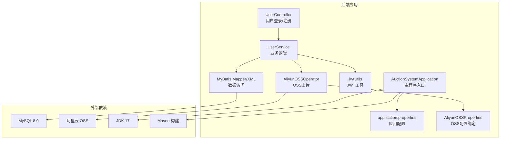
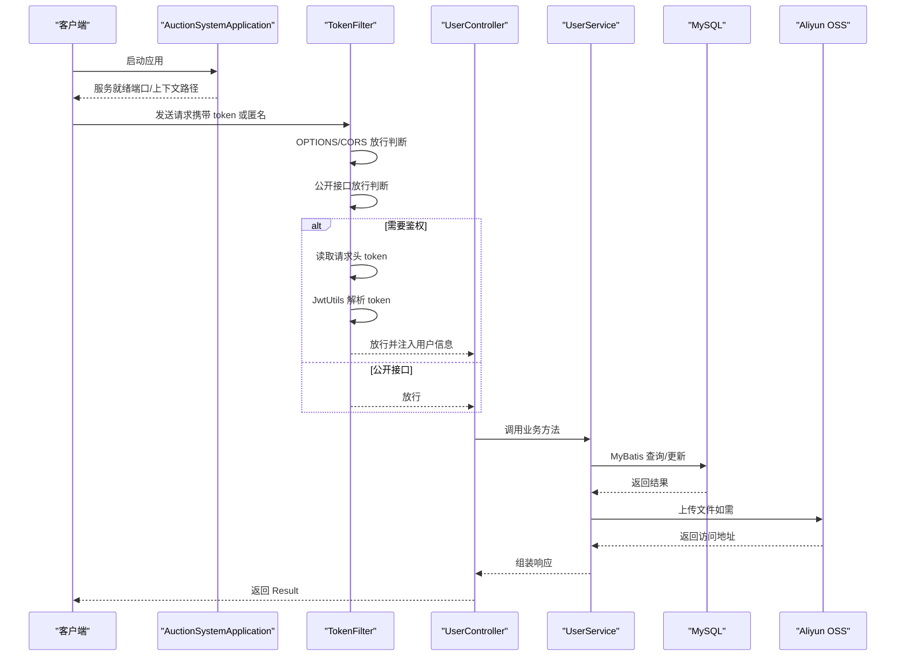
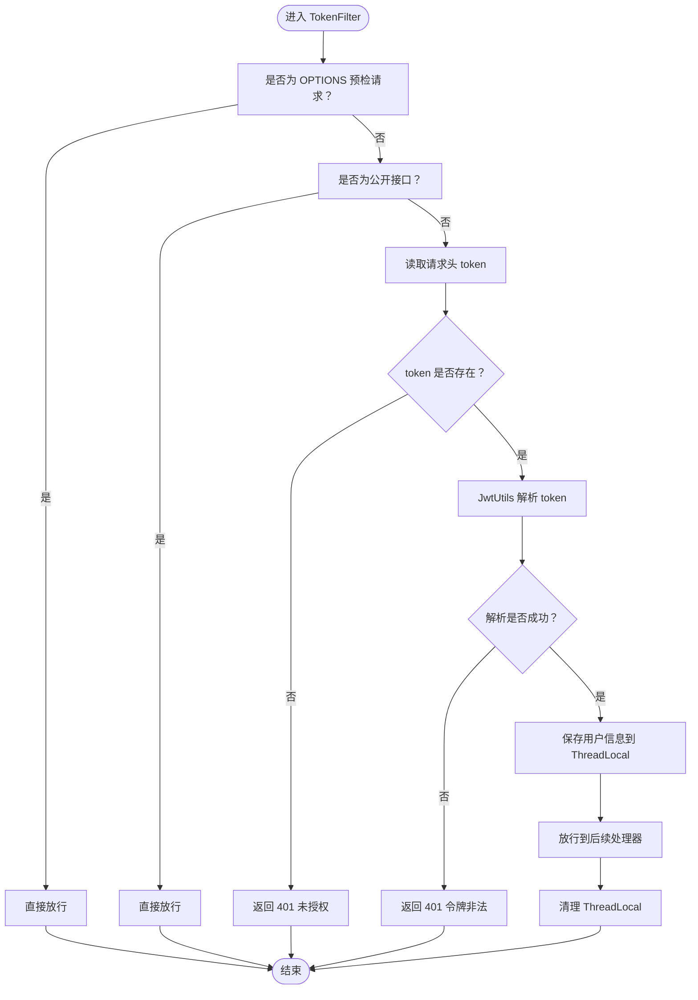
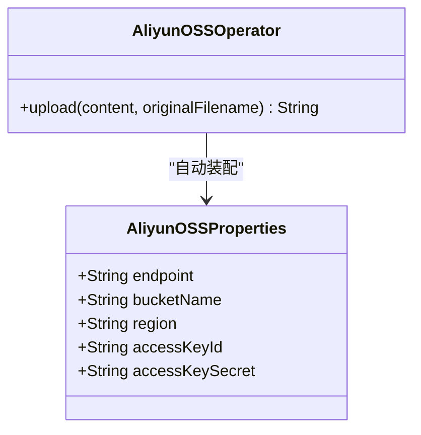
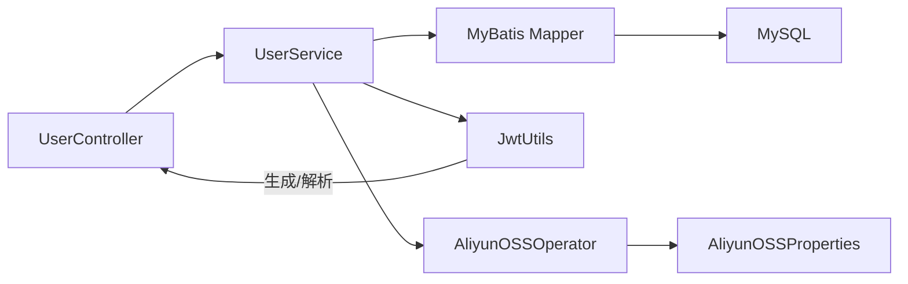

# 部署与配置

<cite>
**本文引用的文件列表**
- [application.properties](file://src/main/resources/application.properties)
- [AliyunOSSProperties.java](file://src/main/java/com/qkl/auctionsystem/properties/AliyunOSSProperties.java)
- [AliyunOSSOperator.java](file://src/main/java/com/qkl/auctionsystem/utils/AliyunOSSOperator.java)
- [JwtUtils.java](file://src/main/java/com/qkl/auctionsystem/utils/JwtUtils.java)
- [TokenFilter.java](file://src/main/java/com/qkl/auctionsystem/filter/TokenFilter.java)
- [UserController.java](file://src/main/java/com/qkl/auctionsystem/controller/UserController.java)
- [pom.xml](file://pom.xml)
- [AuctionSystemApplication.java](file://src/main/java/com/qkl/auctionsystem/AuctionSystemApplication.java)
- [auction_database.sql](file://auction_database.sql)
</cite>

## 目录
1. [简介](#简介)
2. [项目结构](#项目结构)
3. [核心组件](#核心组件)
4. [架构总览](#架构总览)
5. [详细组件分析](#详细组件分析)
6. [依赖关系分析](#依赖关系分析)
7. [性能与稳定性建议](#性能与稳定性建议)
8. [故障排查指南](#故障排查指南)
9. [结论](#结论)
10. [附录：配置项说明表](#附录配置项说明表)

## 简介
本指南面向开发者与运维人员，提供 AuctionSystem 的完整部署与配置说明，包括：
- 在本地或生产环境部署的步骤与注意事项
- application.properties 中数据库连接、JWT 密钥、阿里云 OSS 配置的关键参数设置方法
- AliyunOSSProperties 类通过 Spring Boot ConfigurationProperties 绑定外部配置的工作机制
- 如何导入 auction_database.sql 初始化数据库
- pom.xml 中 Maven 依赖管理与打包流程（mvnw package）
- 运行命令（java -jar AuctionSystem.jar）与环境要求（Java 17、MySQL 8.0）
- 配置项说明表，帮助快速完成环境适配

## 项目结构
项目采用 Spring Boot 标准目录结构，核心模块如下：
- 后端主程序入口：AuctionSystemApplication
- 配置文件：application.properties
- 控制器层：UserController、ItemController、OrderController 等
- 业务服务层：UserService、ItemService、OrderService 及其实现类
- 数据访问层：MyBatis Mapper 与 XML 映射文件
- 工具类：JwtUtils（JWT 生成与解析）、AliyunOSSOperator（OSS 文件上传）
- 配置属性类：AliyunOSSProperties（OSS 配置绑定）

图表来源
- [AuctionSystemApplication.java](file://src/main/java/com/qkl/auctionsystem/AuctionSystemApplication.java#L1-L18)
- [application.properties](file://src/main/resources/application.properties#L1-L20)
- [UserController.java](file://src/main/java/com/qkl/auctionsystem/controller/UserController.java#L1-L49)
- [JwtUtils.java](file://src/main/java/com/qkl/auctionsystem/utils/JwtUtils.java#L1-L36)
- [AliyunOSSOperator.java](file://src/main/java/com/qkl/auctionsystem/utils/AliyunOSSOperator.java#L1-L69)
- [AliyunOSSProperties.java](file://src/main/java/com/qkl/auctionsystem/properties/AliyunOSSProperties.java#L1-L18)
- [pom.xml](file://pom.xml#L1-L129)

章节来源
- [AuctionSystemApplication.java](file://src/main/java/com/qkl/auctionsystem/AuctionSystemApplication.java#L1-L18)
- [application.properties](file://src/main/resources/application.properties#L1-L20)
- [pom.xml](file://pom.xml#L1-L129)

## 核心组件
- 应用入口与启动：AuctionSystemApplication 提供 main 方法，启用调度与 Servlet 组件扫描。
- 配置中心：application.properties 定义了服务器端口、上下文路径、数据库连接、MyBatis 映射与阿里云 OSS 参数。
- JWT 认证：JwtUtils 内置签名密钥与过期时间，配合 TokenFilter 实现统一鉴权。
- OSS 上传：AliyunOSSOperator 优先使用配置文件中的凭证，其次回退到环境变量；通过 AliyunOSSProperties 绑定 ali-oss 前缀配置。
- 数据库初始化：auction_database.sql 包含数据库创建、表结构与初始用户数据。

章节来源
- [AuctionSystemApplication.java](file://src/main/java/com/qkl/auctionsystem/AuctionSystemApplication.java#L1-L18)
- [application.properties](file://src/main/resources/application.properties#L1-L20)
- [JwtUtils.java](file://src/main/java/com/qkl/auctionsystem/utils/JwtUtils.java#L1-L36)
- [TokenFilter.java](file://src/main/java/com/qkl/auctionsystem/filter/TokenFilter.java#L1-L141)
- [AliyunOSSOperator.java](file://src/main/java/com/qkl/auctionsystem/utils/AliyunOSSOperator.java#L1-L69)
- [AliyunOSSProperties.java](file://src/main/java/com/qkl/auctionsystem/properties/AliyunOSSProperties.java#L1-L18)
- [auction_database.sql](file://auction_database.sql#L1-L78)

## 架构总览
下图展示应用启动、请求拦截、鉴权与数据访问的整体流程。

图表来源
- [AuctionSystemApplication.java](file://src/main/java/com/qkl/auctionsystem/AuctionSystemApplication.java#L1-L18)
- [TokenFilter.java](file://src/main/java/com/qkl/auctionsystem/filter/TokenFilter.java#L1-L141)
- [UserController.java](file://src/main/java/com/qkl/auctionsystem/controller/UserController.java#L1-L49)
- [JwtUtils.java](file://src/main/java/com/qkl/auctionsystem/utils/JwtUtils.java#L1-L36)
- [AliyunOSSOperator.java](file://src/main/java/com/qkl/auctionsystem/utils/AliyunOSSOperator.java#L1-L69)

## 详细组件分析

### 数据库连接与初始化
- 连接参数位置：application.properties 中的 spring.datasource.* 配置项定义了 JDBC URL、用户名、密码与驱动类。
- MyBatis 配置：mapper 映射文件位置、实体包别名与下划线转驼峰映射。
- 初始化脚本：auction_database.sql 包含数据库创建、表结构与初始用户数据（管理员与普通用户）。

部署步骤要点
- 准备 MySQL 8.0 实例，确保网络可达与权限正确。
- 在 application.properties 中修改 spring.datasource.url、username、password 以匹配你的数据库实例。
- 执行 auction_database.sql 完成数据库与表结构初始化。
- 启动应用后，可使用初始管理员账户登录后台。

章节来源
- [application.properties](file://src/main/resources/application.properties#L1-L20)
- [auction_database.sql](file://auction_database.sql#L1-L78)

### JWT 配置与鉴权流程
- 密钥与过期：JwtUtils 内置签名密钥与过期时长，用于生成与解析 JWT。
- 登录签发：UserController 在用户登录成功后生成 token，并将用户 id 与角色放入 claims。
- 统一拦截：TokenFilter 对非公开接口进行 token 校验，校验失败返回 401。
- 用户信息透传：通过 ThreadLocal 保存当前线程的用户 id 与角色，便于后续业务使用。

图表来源
- [TokenFilter.java](file://src/main/java/com/qkl/auctionsystem/filter/TokenFilter.java#L1-L141)
- [JwtUtils.java](file://src/main/java/com/qkl/auctionsystem/utils/JwtUtils.java#L1-L36)
- [UserController.java](file://src/main/java/com/qkl/auctionsystem/controller/UserController.java#L1-L49)

章节来源
- [JwtUtils.java](file://src/main/java/com/qkl/auctionsystem/utils/JwtUtils.java#L1-L36)
- [TokenFilter.java](file://src/main/java/com/qkl/auctionsystem/filter/TokenFilter.java#L1-L141)
- [UserController.java](file://src/main/java/com/qkl/auctionsystem/controller/UserController.java#L1-L49)

### 阿里云 OSS 配置与绑定
- 配置前缀：application.properties 中以 aliyun.oss.* 开头的键值对。
- 属性类绑定：AliyunOSSProperties 使用 @ConfigurationProperties(prefix = "aliyun.oss") 将配置映射为 Java 对象。
- 上传实现：AliyunOSSOperator 优先使用配置文件中的 accessKeyId/accessKeySecret，若为空则尝试从环境变量加载；随后按日期目录与随机文件名生成对象名并上传至 OSS，最后返回可访问的 URL。

图表来源
- [AliyunOSSProperties.java](file://src/main/java/com/qkl/auctionsystem/properties/AliyunOSSProperties.java#L1-L18)
- [AliyunOSSOperator.java](file://src/main/java/com/qkl/auctionsystem/utils/AliyunOSSOperator.java#L1-L69)

章节来源
- [application.properties](file://src/main/resources/application.properties#L15-L20)
- [AliyunOSSProperties.java](file://src/main/java/com/qkl/auctionsystem/properties/AliyunOSSProperties.java#L1-L18)
- [AliyunOSSOperator.java](file://src/main/java/com/qkl/auctionsystem/utils/AliyunOSSOperator.java#L1-L69)

### Maven 依赖管理与打包流程
- Java 版本：pom.xml 中 properties 指定 java.version=17。
- 核心依赖：spring-boot-starter-webmvc、mybatis-spring-boot-starter、mysql-connector-j、lombok、测试依赖、JWT 依赖、阿里云 OSS SDK、PageHelper 分页插件。
- 构建插件：spring-boot-maven-plugin 用于打包可执行 jar，默认排除 lombok 注解处理器。
- 打包命令：使用 mvnw package 生成可执行 jar，产物位于 target 目录。

章节来源
- [pom.xml](file://pom.xml#L1-L129)

### 运行与环境要求
- 环境要求：JDK 17、MySQL 8.0。
- 运行方式：构建完成后在 target 目录执行 java -jar AuctionSystem.jar。
- 默认端口与上下文：server.port=8081，server.servlet.context-path=/auction。

章节来源
- [pom.xml](file://pom.xml#L1-L129)
- [application.properties](file://src/main/resources/application.properties#L1-L3)

## 依赖关系分析
- 组件耦合：Controller 依赖 Service；Service 依赖 Mapper；Service 依赖工具类（JwtUtils、AliyunOSSOperator）；OSSOperator 依赖 AliyunOSSProperties。
- 外部依赖：MySQL 驱动、MyBatis、JWT、阿里云 OSS SDK、PageHelper。
- 构建插件：spring-boot-maven-plugin 负责打包。

图表来源
- [UserController.java](file://src/main/java/com/qkl/auctionsystem/controller/UserController.java#L1-L49)
- [JwtUtils.java](file://src/main/java/com/qkl/auctionsystem/utils/JwtUtils.java#L1-L36)
- [AliyunOSSOperator.java](file://src/main/java/com/qkl/auctionsystem/utils/AliyunOSSOperator.java#L1-L69)
- [AliyunOSSProperties.java](file://src/main/java/com/qkl/auctionsystem/properties/AliyunOSSProperties.java#L1-L18)

章节来源
- [UserController.java](file://src/main/java/com/qkl/auctionsystem/controller/UserController.java#L1-L49)
- [JwtUtils.java](file://src/main/java/com/qkl/auctionsystem/utils/JwtUtils.java#L1-L36)
- [AliyunOSSOperator.java](file://src/main/java/com/qkl/auctionsystem/utils/AliyunOSSOperator.java#L1-L69)
- [AliyunOSSProperties.java](file://src/main/java/com/qkl/auctionsystem/properties/AliyunOSSProperties.java#L1-L18)

## 性能与稳定性建议
- 数据库连接池与超时：根据并发量调整连接池大小与查询超时，避免长时间阻塞。
- JWT 过期策略：结合业务场景调整过期时间，平衡安全与用户体验。
- OSS 上传优化：批量上传或断点续传可减少失败重试成本；合理设置对象命名规则与生命周期。
- 日志与监控：开启必要的日志级别与指标采集，定位慢查询与异常请求。
- 分页与索引：PageHelper 与数据库索引配合，确保高并发下的查询性能。

## 故障排查指南
常见问题与定位思路
- 数据库无法连接
  - 检查 spring.datasource.url、username、password 是否正确。
  - 确认 MySQL 8.0 实例可达且防火墙放行。
  - 执行 auction_database.sql 初始化数据库与表结构。
- JWT 401 未授权
  - 确认请求头是否携带 token，且格式正确。
  - 检查 JwtUtils 内置密钥是否被意外修改（如需更换请同步前后端约定）。
- OSS 上传失败
  - 确认 aliyun.oss.* 配置是否完整。
  - 若使用环境变量，请确认环境变量已正确设置。
  - 查看 AliyunOSSOperator 抛出的异常日志，定位凭证或网络问题。
- 启动失败或端口占用
  - 修改 server.port 或释放端口占用。
  - 确认 JDK 17 已安装且 JAVA_HOME 正确。

章节来源
- [application.properties](file://src/main/resources/application.properties#L1-L20)
- [JwtUtils.java](file://src/main/java/com/qkl/auctionsystem/utils/JwtUtils.java#L1-L36)
- [AliyunOSSOperator.java](file://src/main/java/com/qkl/auctionsystem/utils/AliyunOSSOperator.java#L1-L69)
- [TokenFilter.java](file://src/main/java/com/qkl/auctionsystem/filter/TokenFilter.java#L1-L141)

## 结论
通过本指南，您可以在本地或生产环境中完成 AuctionSystem 的部署与配置。重点在于：
- 正确设置数据库连接与初始化脚本
- 配置 JWT 密钥与 OSS 凭证
- 使用 Maven 正确打包并以 java -jar 方式运行
- 借助 TokenFilter 与 JwtUtils 实现统一鉴权
- 通过 AliyunOSSProperties 与 AliyunOSSOperator 完成对象存储集成

## 附录：配置项说明表
以下表格汇总了 application.properties 中的关键配置项及其用途，便于运维快速适配。

- 通用
  - spring.application.name：应用名称
  - server.port：HTTP 服务端口
  - server.servlet.context-path：应用上下文路径

- 数据库（MySQL）
  - spring.datasource.url：JDBC 连接串（含主机、端口、数据库名、时区等）
  - spring.datasource.username：数据库用户名
  - spring.datasource.password：数据库密码
  - spring.datasource.driver-class-name：JDBC 驱动类名

- MyBatis
  - mybatis.mapper-locations：XML 映射文件位置
  - mybatis.type-aliases-package：实体类型别名包
  - mybatis.configuration.mapUnderscoreToCamelCase：字段下划线转驼峰

- 阿里云 OSS
  - aliyun.oss.endpoint：OSS 接入域名
  - aliyun.oss.bucket-name：存储空间名称
  - aliyun.oss.region：区域
  - aliyun.oss.access-key-id：访问密钥 ID
  - aliyun.oss.access-key-secret：访问密钥 Secret

章节来源
- [application.properties](file://src/main/resources/application.properties#L1-L20)