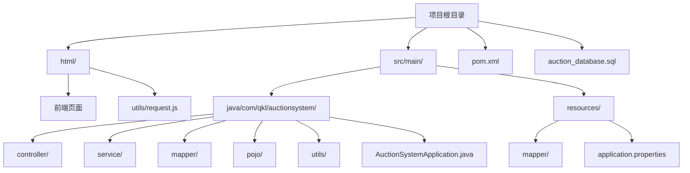
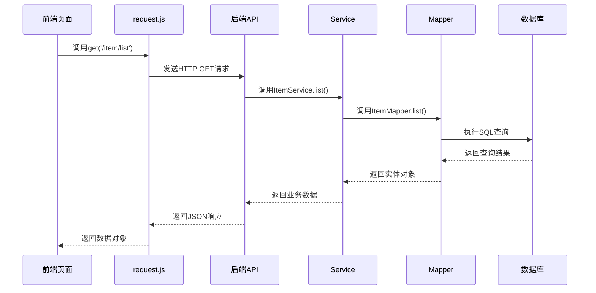
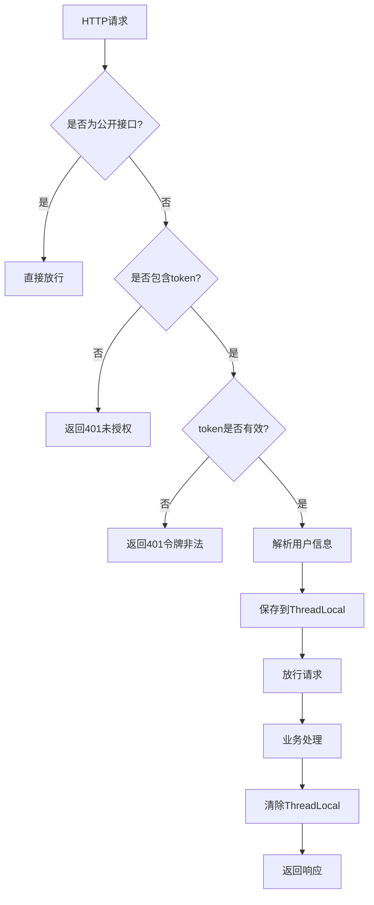

# 项目目录结构详解

<cite>
**本文档引用的文件**   
- [pom.xml](file://pom.xml)
- [application.properties](file://src/main/resources/application.properties)
- [auction_database.sql](file://auction_database.sql)
- [AuctionSystemApplication.java](file://src/main/java/com/qkl/auctionsystem/AuctionSystemApplication.java)
- [request.js](file://html/utils/request.js)
- [index.html](file://html/index.html)
- [admin-dashboard.html](file://html/admin-dashboard.html)
- [UserController.java](file://src/main/java/com/qkl/auctionsystem/controller/UserController.java)
- [UserServiceImpl.java](file://src/main/java/com/qkl/auctionsystem/service/impl/UserServiceImpl.java)
- [UserMapper.java](file://src/main/java/com/qkl/auctionsystem/mapper/UserMapper.java)
- [UserMapper.xml](file://src/main/resources/mapper/UserMapper.xml)
- [User.java](file://src/main/java/com/qkl/auctionsystem/pojo/entity/User.java)
- [UserDTO.java](file://src/main/java/com/qkl/auctionsystem/pojo/dto/UserDTO.java)
- [Result.java](file://src/main/java/com/qkl/auctionsystem/result/Result.java)
- [JwtUtils.java](file://src/main/java/com/qkl/auctionsystem/utils/JwtUtils.java)
- [TokenFilter.java](file://src/main/java/com/qkl/auctionsystem/filter/TokenFilter.java)
</cite>

## 目录结构概览

AuctionSystem项目采用标准的Maven多层架构，整体目录结构清晰，分为前端、后端、配置和数据库四个主要部分。项目根目录包含Maven构建文件、数据库脚本和说明文档，`html/`目录存放所有前端页面和工具脚本，`src/main/`目录遵循Java标准结构，包含Java源码和资源文件。



**目录来源**
- [项目结构](file://)

## 前端目录结构

前端代码位于`html/`目录下，采用静态HTML+CSS+JavaScript的架构，包含多个HTML页面和一个工具脚本。

### 前端页面

`html/`目录下的HTML文件构成了系统的用户界面：

- `index.html`: 系统首页，展示拍品列表
- `login.html`: 用户登录页面
- `register.html`: 用户注册页面
- `item-detail.html`: 拍品详情页面
- `user-order.html`: 用户订单页面
- `admin-login.html`: 管理员登录页面
- `admin-dashboard.html`: 管理员后台管理页面

### 前端工具脚本

`html/utils/request.js`是前端的核心工具脚本，封装了与后端API通信的所有HTTP请求方法。该文件使用ES6模块语法，导出`get`、`post`、`put`、`del`和`postFormData`等函数，统一处理请求头、响应解析和错误处理。

```javascript
// request.js中的请求封装
export async function get(url, params = {}) {
    // 实现GET请求
}

export async function post(url, data = {}) {
    // 实现POST请求
}
```

**前端来源**
- [html/index.html](file://html/index.html#L1-L426)
- [html/admin-dashboard.html](file://html/admin-dashboard.html#L1-L800)
- [html/utils/request.js](file://html/utils/request.js#L1-L131)

## 后端MVC架构

后端代码位于`src/main/java/com/qkl/auctionsystem/`目录下，严格遵循MVC（Model-View-Controller）设计模式，通过分层架构实现关注点分离。

### 控制层（Controller）

`controller/`包包含所有REST API的入口点，负责接收HTTP请求、调用服务层处理业务逻辑，并返回响应结果。每个控制器类对应一个业务模块：

- `UserController.java`: 用户注册和登录
- `AdminController.java`: 管理员登录和权限验证
- `ItemController.java`: 拍品管理
- `BidController.java`: 竞拍管理
- `OrderController.java`: 订单管理

```java
@RestController
@RequestMapping("/user")
public class UserController {
    @Autowired
    private UserService userService;

    @PostMapping("/register")
    public Result userRegister(@RequestBody UserDTO userDTO) {
        userService.userRegister(userDTO);
        return Result.success();
    }
}
```

**控制器来源**
- [UserController.java](file://src/main/java/com/qkl/auctionsystem/controller/UserController.java#L1-L49)
- [AdminController.java](file://src/main/java/com/qkl/auctionsystem/controller/AdminController.java#L1-L73)

### 服务层（Service）

`service/`包包含业务逻辑的实现，分为接口定义和具体实现两个部分。接口定义在`service/`包下，具体实现在`service/impl/`包下。

```java
// UserService.java
public interface UserService {
    void userRegister(UserDTO userDTO);
    User userLogin(UserDTO userDTO);
    User adminLogin(UserDTO userDTO);
}

// UserServiceImpl.java
@Service
public class UserServiceImpl implements UserService {
    @Autowired
    private UserMapper userMapper;

    @Override
    public void userRegister(UserDTO userDTO) {
        User user = new User();
        BeanUtils.copyProperties(userDTO, user);
        userMapper.userRegister(user);
    }
}
```

**服务层来源**
- [UserServiceImpl.java](file://src/main/java/com/qkl/auctionsystem/service/impl/UserServiceImpl.java#L1-L59)

### 数据访问层（Mapper）

`mapper/`包包含MyBatis的Mapper接口，定义了与数据库交互的方法。这些接口通过注解或XML配置映射到具体的SQL语句。

```java
@Mapper
public interface UserMapper {
    void userRegister(User user);
    User userLogin(String username);
}
```

对应的SQL语句在`src/main/resources/mapper/`目录下的XML文件中定义：

```xml
<mapper namespace="com.qkl.auctionsystem.mapper.UserMapper">
    <insert id="userRegister">
        insert user(username,password,role,create_time,update_time) 
        values(#{username},#{password},#{role},#{createTime},#{updateTime})
    </insert>
    <select id="userLogin" resultType="com.qkl.auctionsystem.pojo.entity.User">
        select * from user where username = #{username}
    </select>
</mapper>
```

**数据访问层来源**
- [UserMapper.java](file://src/main/java/com/qkl/auctionsystem/mapper/UserMapper.java#L1-L13)
- [UserMapper.xml](file://src/main/resources/mapper/UserMapper.xml#L1-L11)

### 模型层（POJO）

`pojo/`包包含数据传输对象（DTO）和实体类（Entity），用于在不同层之间传递数据。

#### 实体类（Entity）

`pojo/entity/`包下的类对应数据库表结构：

```java
@Data
public class User {
    private Integer id;
    private String username;
    private String password;
    private Integer role;
    private LocalDateTime createTime;
    private LocalDateTime updateTime;
}
```

#### 数据传输对象（DTO）

`pojo/dto/`包下的类用于接收前端传来的数据：

```java
@Data
public class UserDTO {
    private Integer id;
    private String username;
    private String password;
    private Integer role;
}
```

**模型层来源**
- [User.java](file://src/main/java/com/qkl/auctionsystem/pojo/entity/User.java#L1-L26)
- [UserDTO.java](file://src/main/java/com/qkl/auctionsystem/pojo/dto/UserDTO.java#L1-L12)

## 配置文件

### Maven配置（pom.xml）

`pom.xml`是Maven项目的配置文件，定义了项目的基本信息、依赖管理和构建配置。

```xml
<project>
    <parent>
        <groupId>org.springframework.boot</groupId>
        <artifactId>spring-boot-starter-parent</artifactId>
        <version>4.0.1</version>
    </parent>
    <dependencies>
        <dependency>
            <groupId>org.springframework.boot</groupId>
            <artifactId>spring-boot-starter-webmvc</artifactId>
        </dependency>
        <dependency>
            <groupId>org.mybatis.spring.boot</groupId>
            <artifactId>mybatis-spring-boot-starter</artifactId>
            <version>4.0.0</version>
        </dependency>
        <!-- JWT依赖 -->
        <dependency>
            <groupId>io.jsonwebtoken</groupId>
            <artifactId>jjwt-api</artifactId>
            <version>0.11.5</version>
        </dependency>
    </dependencies>
</project>
```

**Maven配置来源**
- [pom.xml](file://pom.xml#L1-L129)

### 应用配置（application.properties）

`src/main/resources/application.properties`包含应用程序的运行时配置：

```properties
# 服务器配置
server.port=8081
server.servlet.context-path=/auction

# 数据库配置
spring.datasource.url=jdbc:mysql://localhost:8864/auction?useUnicode=true&characterEncoding=utf8&useSSL=false&serverTimezone=GMT%2B8
spring.datasource.username=auction
spring.datasource.password=hibhcKtWHy5BaRyM

# MyBatis配置
mybatis.mapper-locations=classpath:mapper/*.xml
mybatis.type-aliases-package=qkl.zn.AuctionSystem.pojo.entity
```

**应用配置来源**
- [application.properties](file://src/main/resources/application.properties#L1-L20)

## 数据库结构

`auction_database.sql`文件定义了数据库的Schema，包含用户、拍品、竞拍记录和订单四张表。

### 数据库表结构

```sql
-- 用户表
CREATE TABLE user (
    id BIGINT AUTO_INCREMENT,
    username VARCHAR(50) NOT NULL,
    password VARCHAR(128) NOT NULL,
    role TINYINT NOT NULL DEFAULT 1,
    create_time DATETIME NOT NULL DEFAULT CURRENT_TIMESTAMP,
    update_time DATETIME NOT NULL DEFAULT CURRENT_TIMESTAMP ON UPDATE CURRENT_TIMESTAMP,
    PRIMARY KEY (id),
    UNIQUE KEY uk_username (username)
);

-- 拍品表
CREATE TABLE auction_item (
    id BIGINT AUTO_INCREMENT,
    title VARCHAR(100) NOT NULL,
    image VARCHAR(255),
    initial_price DECIMAL(10,2) NOT NULL,
    description VARCHAR(500),
    start_time DATETIME NOT NULL,
    end_time DATETIME NOT NULL,
    current_max_price DECIMAL(10,2) NOT NULL DEFAULT 0.00,
    current_max_user_id BIGINT,
    status TINYINT NOT NULL DEFAULT 0,
    listing_status TINYINT NOT NULL DEFAULT 1,
    create_time DATETIME NOT NULL DEFAULT CURRENT_TIMESTAMP,
    update_time DATETIME NOT NULL DEFAULT CURRENT_TIMESTAMP ON UPDATE CURRENT_TIMESTAMP,
    PRIMARY KEY (id)
);
```

**数据库来源**
- [auction_database.sql](file://auction_database.sql#L1-L78)

## 系统协作关系

### 前后端通信流程

系统采用前后端分离架构，前端通过AJAX调用后端REST API，后端通过MyBatis Mapper访问数据库。



**通信流程来源**
- [request.js](file://html/utils/request.js#L33-L47)
- [UserController.java](file://src/main/java/com/qkl/auctionsystem/controller/UserController.java#L23-L28)

### 安全认证机制

系统使用JWT（JSON Web Token）进行用户认证和授权，通过过滤器实现统一的权限控制。



**安全机制来源**
- [JwtUtils.java](file://src/main/java/com/qkl/auctionsystem/utils/JwtUtils.java#L1-L36)
- [TokenFilter.java](file://src/main/java/com/qkl/auctionsystem/filter/TokenFilter.java#L1-L141)

### 统一响应格式

后端使用`Result`类封装统一的响应格式，确保前后端通信的一致性。

```java
@Data
public class Result<T> implements Serializable {
    private Integer code; // 1成功，0失败
    private String msg;   // 错误信息
    private T data;       // 数据

    public static <T> Result<T> success() {
        Result<T> result = new Result<T>();
        result.code = 1;
        return result;
    }

    public static <T> Result<T> success(T object) {
        Result<T> result = new Result<T>();
        result.data = object;
        result.code = 1;
        return result;
    }

    public static <T> Result<T> error(String msg) {
        Result result = new Result();
        result.msg = msg;
        result.code = 0;
        return result;
    }
}
```

**响应格式来源**
- [Result.java](file://src/main/java/com/qkl/auctionsystem/result/Result.java#L1-L39)

## 项目启动入口

`AuctionSystemApplication.java`是Spring Boot应用的启动类，包含`main`方法作为程序入口。

```java
@SpringBootApplication
public class AuctionSystemApplication {
    public static void main(String[] args) {
        SpringApplication.run(AuctionSystemApplication.class, args);
    }
}
```

**启动类来源**
- [AuctionSystemApplication.java](file://src/main/java/com/qkl/auctionsystem/AuctionSystemApplication.java#L1-L18)

## 目录组织逻辑总结

AuctionSystem项目的目录结构体现了清晰的分层架构和关注点分离原则：

1. **前端分离**：`html/`目录独立存放所有前端资源，便于静态文件的管理和部署
2. **MVC分层**：后端代码严格遵循MVC模式，controller、service、mapper、pojo等包职责分明
3. **配置集中**：所有配置文件集中在`src/main/resources/`目录下，包括application.properties和MyBatis的Mapper XML文件
4. **依赖管理**：通过pom.xml统一管理Maven依赖，确保项目构建的一致性
5. **数据库独立**：auction_database.sql独立存放，便于数据库的初始化和迁移

这种组织方式使得项目结构清晰，便于团队协作开发和后期维护。

**总结来源**
- [项目结构](file://)
- [pom.xml](file://pom.xml)
- [application.properties](file://src/main/resources/application.properties)
- [auction_database.sql](file://auction_database.sql)